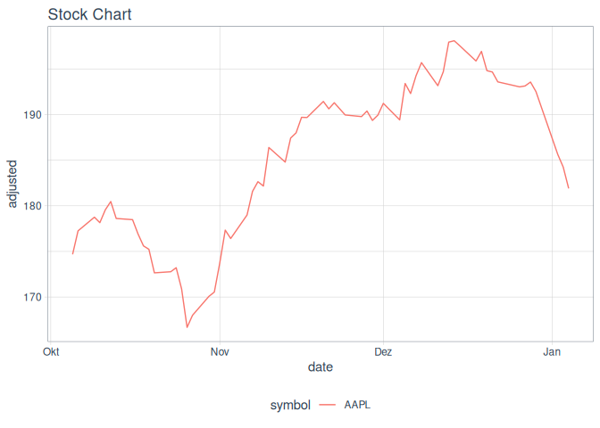
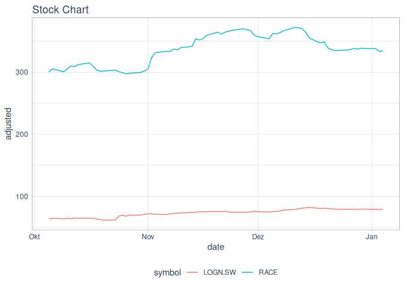
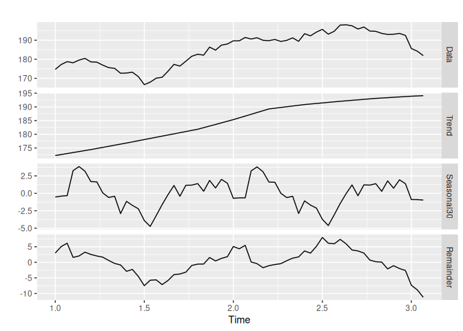
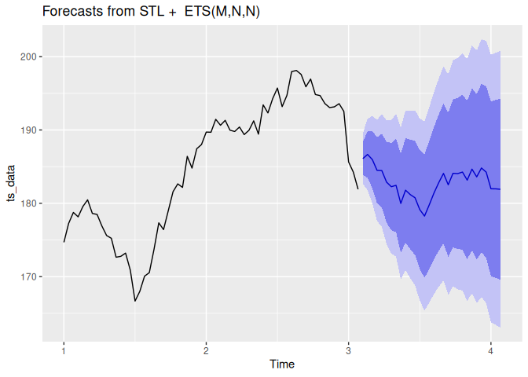
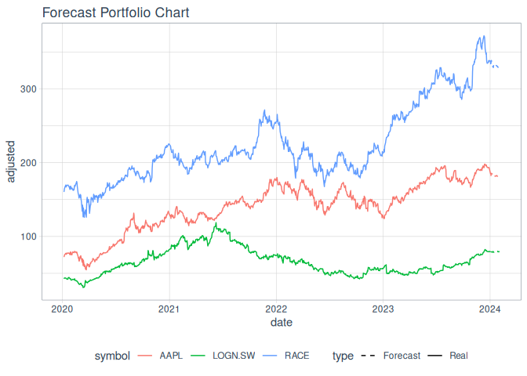

<!-- README.md is generated from README.Rmd. Please edit that file -->

# richme

<!-- badges: start -->
<!-- badges: end -->

The package `richme` is aimed at easing the work of portfolio simulation
and simple forecasting making use of yahoo finance open data. It is free
of use, and under construction. Feel free to add issues and improve as
will.

## Installation

You can install the development version of `richme` like so:

``` r
devtools::install_github("hurielreichel/richme")
```

## Getting and Visualising data

`richme` can be used to very easily get yahoo data given a frame of
dates, and one or multiple symbols:

``` r
library(richme)
#> Loading required package: cli
#> Loading required package: tidyverse
#> ── Attaching core tidyverse packages ──────────────────────── tidyverse 2.0.0 ──
#> ✔ dplyr     1.1.3     ✔ readr     2.1.4
#> ✔ forcats   1.0.0     ✔ stringr   1.5.0
#> ✔ ggplot2   3.4.4     ✔ tibble    3.2.1
#> ✔ lubridate 1.9.2     ✔ tidyr     1.3.0
#> ✔ purrr     1.0.2     
#> ── Conflicts ────────────────────────────────────────── tidyverse_conflicts() ──
#> ✖ dplyr::filter() masks stats::filter()
#> ✖ dplyr::lag()    masks stats::lag()
#> ℹ Use the conflicted package (<http://conflicted.r-lib.org/>) to force all conflicts to become errors
#> Loading required package: tidyquant
#> 
#> Loading required package: PerformanceAnalytics
#> 
#> Loading required package: xts
#> 
#> Loading required package: zoo
#> 
#> 
#> Attaching package: 'zoo'
#> 
#> 
#> The following objects are masked from 'package:base':
#> 
#>     as.Date, as.Date.numeric
#> 
#> 
#> 
#> ######################### Warning from 'xts' package ##########################
#> #                                                                             #
#> # The dplyr lag() function breaks how base R's lag() function is supposed to  #
#> # work, which breaks lag(my_xts). Calls to lag(my_xts) that you type or       #
#> # source() into this session won't work correctly.                            #
#> #                                                                             #
#> # Use stats::lag() to make sure you're not using dplyr::lag(), or you can add #
#> # conflictRules('dplyr', exclude = 'lag') to your .Rprofile to stop           #
#> # dplyr from breaking base R's lag() function.                                #
#> #                                                                             #
#> # Code in packages is not affected. It's protected by R's namespace mechanism #
#> # Set `options(xts.warn_dplyr_breaks_lag = FALSE)` to suppress this warning.  #
#> #                                                                             #
#> ###############################################################################
#> 
#> 
#> Attaching package: 'xts'
#> 
#> 
#> The following objects are masked from 'package:dplyr':
#> 
#>     first, last
#> 
#> 
#> 
#> Attaching package: 'PerformanceAnalytics'
#> 
#> 
#> The following object is masked from 'package:graphics':
#> 
#>     legend
#> 
#> 
#> Loading required package: quantmod
#> 
#> Loading required package: TTR
#> 
#> Registered S3 method overwritten by 'quantmod':
#>   method            from
#>   as.zoo.data.frame zoo 
#> 
#> Loading required package: forecast

dt <- get_yahoo_data(code = "AAPL", start = "2023-10-05")
dt_m <- get_yahoo_data(code = c("LOGN.SW", "RACE"), start = "2023-10-05")
```

For the first data frame, we got some data for Apple and then both
Logitech and Ferrari. Let’s have a look at what we downloaded for Apple
stocks:

``` r
dt |> head()
#> # A tibble: 6 × 3
#>   symbol date       adjusted
#>   <chr>  <date>        <dbl>
#> 1 AAPL   2023-10-05     175.
#> 2 AAPL   2023-10-06     177.
#> 3 AAPL   2023-10-09     179.
#> 4 AAPL   2023-10-10     178.
#> 5 AAPL   2023-10-11     180.
#> 6 AAPL   2023-10-12     180.
```

After that, let’s have a look at the other one with two different
stocks:

``` r
dt_m |> head()
#> # A tibble: 6 × 3
#>   symbol  date       adjusted
#>   <chr>   <date>        <dbl>
#> 1 LOGN.SW 2023-10-05     63.9
#> 2 LOGN.SW 2023-10-06     64.8
#> 3 LOGN.SW 2023-10-09     64.0
#> 4 LOGN.SW 2023-10-10     64.8
#> 5 LOGN.SW 2023-10-11     64.1
#> 6 LOGN.SW 2023-10-12     65.4
```

``` r
dt_m |> tail()
#> # A tibble: 6 × 3
#>   symbol date       adjusted
#>   <chr>  <date>        <dbl>
#> 1 RACE   2023-12-27     338.
#> 2 RACE   2023-12-28     337.
#> 3 RACE   2023-12-29     338.
#> 4 RACE   2024-01-02     338.
#> 5 RACE   2024-01-03     333.
#> 6 RACE   2024-01-04     334.
```

Once that is done, we can use `richme` for many more things. First of
all, let’s have a look at the data through a plot using
`plot_stock_lines` function:

``` r
dt |> plot_stock_lines()
```



What happens if we have multiple stocks?

``` r
dt_m |> plot_stock_lines()
```



## Computing Gains

A simple, but important topic is to quickly view how much did a certain
stock increase or decrease in a given interval. With `richme`, one can
make use of `compute_gains` function for that purpose:

``` r
dt |> compute_gains()
#> # A tibble: 1 × 3
#>   symbol percentage_change abs_change
#>   <chr>              <dbl>      <dbl>
#> 1 AAPL                4.14       7.23
```

The `percentage_change` computes the change in percentage and the
`abs_change` shows the absolute change in the stock value.

The function also works when having more than one symbol:

``` r
dt_m |> compute_gains()
#> # A tibble: 2 × 3
#>   symbol  percentage_change abs_change
#>   <chr>               <dbl>      <dbl>
#> 1 LOGN.SW              24.0       15.3
#> 2 RACE                 11.5       34.5
```

## Portfolio Simulation

### In the past

A trick that is pretty interesting to do is to check how much a
portfolio would have valued in a given time in the past. The function
`simulate_portfolio_past` will do that for you. Let’s say I thought
about investing in Ferrari, Apple, and in Logitech from 01.01.2023 to
31.12.2023. Let’s do two scenarios, where in one we will invest 1000 in
Ferrari, 2000 in Logitech, and 1500 in Logitech.

``` r
dt_port <- get_yahoo_data(code = c('RACE', 'AAPL', 'LOGN.SW'))
inves_df <- tibble(
  symbol = c(  'RACE', 'AAPL', 'LOGN.SW'), 
  investment = c(1000,   2000,     1500))
p1 <- dt_port |> 
  simulate_portfolio_past(
    investment_df = inves_df,
    start = "2023-01-01", 
    end = "2023-12-31")
#> Joining with `by = join_by(symbol)`

return = p1 |> pull(return) |> sum() |> round(2)
investment = p1 |> pull(investment) |> sum() |> round(2)
cli::cli_alert_info(paste(return - investment, "of gains with portfolio 1"))
#> ℹ 2253.25 of gains with portfolio 1
```

Now let’s do the same with 1750 in Ferrari, 750 in Logitech, and 2000 in
Logitech:

``` r
inves_df <- tibble(
  symbol = c(  'RACE', 'AAPL', 'LOGN.SW'), 
  investment = c(1750,   750,     2000))
p2 <- dt_port |> 
  simulate_portfolio_past(
    investment_df = inves_df,
    start = "2023-01-01", 
    end = "2023-12-31")
#> Joining with `by = join_by(symbol)`

return = p2 |> pull(return) |> sum() |> round(2)
investment = p2 |> pull(investment) |> sum() |> round(2)
cli::cli_alert_info(paste(return - investment, "of gains with portfolio 2"))
#> ℹ 2196.83 of gains with portfolio 2
```

Where would we have been more successfull?

### In the future

Looking at the past is not always the best when we are willing to make
the choices for the future. The use of a forecasting system is therefore
of great interest. For `richme`, so far, we are making use of the
`forecast` package and most specifically, the [STLF
methodology](https://www.rdocumentation.org/packages/forecast/versions/8.15/topics/forecast.stl).
It’s a rather simple method that allows the decomposition of a time
series in to noise, seasonality and trend. The forecast functions to do
the decomposition and the forecasting *per se* are all wrapped into the
`forecast_stock` (for a single stock), and `simulate_portfolio_future`
(for multiple stocks).

Let’s have a look at some usage below:

``` r
forecast_aapl <- dt |> forecast_stock()
forecast_aapl |> names()
#> [1] "pred_df"        "gains_forecast" "trend_plot"     "forecast_plot"
```

As one can see, the outcome of the function is a list, containing
different items. Let’s take a closer look:

``` r
forecast_aapl$pred_df |> head()
#> # A tibble: 6 × 4
#>   symbol date       adjusted type 
#>   <chr>  <date>        <dbl> <chr>
#> 1 AAPL   2023-10-05     175. Real 
#> 2 AAPL   2023-10-06     177. Real 
#> 3 AAPL   2023-10-09     179. Real 
#> 4 AAPL   2023-10-10     178. Real 
#> 5 AAPL   2023-10-11     180. Real 
#> 6 AAPL   2023-10-12     180. Real
```

With the `pred_df`, one has access to the data frame with both real data
and forecast for future possible wrangling. It’s probably what one would
expect if you’d like to explore the results further.

With `gains_forecast` , one will find the outcome of `compute_gains` but
then in the future:

``` r
forecast_aapl$gains_forecast
#> # A tibble: 1 × 3
#>   symbol percentage_change abs_change
#>   <chr>              <dbl>      <dbl>
#> 1 AAPL            0.000126   0.000230
```

Finally, we go to the fun part: the charts! In this case, all charts
that you would have whilst using `forecast` package directly.

``` r
forecast_aapl$trend_plot
```



``` r
forecast_aapl$forecast_plot
```



As we simulated a portfolio in the past, let’s do the same with it in
the future:

``` r
inves_df <- tibble(
  symbol = c(  'RACE', 'AAPL', 'LOGN.SW'), 
  investment = c(1000,   2000,     1500))
forecast_p1 <- dt_port |> 
  simulate_portfolio_future(inves_df)
#> Joining with `by = join_by(symbol)`
#> Joining with `by = join_by(symbol)`
#> Joining with `by = join_by(symbol)`
#> Joining with `by = join_by(symbol)`
forecast_p1 |> names()
#> [1] "RACE"           "AAPL"           "LOGN.SW"        "portfolio_plot"
#> [5] "pred_df_c"      "gains"
```

Now you can see one can see all the stocks combined or individually in
the list. Let’s have a look at our gains, for example:

``` r
return = forecast_p1$gains |> pull(return) |> sum() |> round(2)
investment = forecast_p1$gains |> pull(investment) |> sum() |> round(2)
cli::cli_alert_info(paste(return - investment, "of predicted gains with portfolio 1"))
#> ℹ 5325.46 of predicted gains with portfolio 1
```

And then why not take a look at all forecasts:

``` r
forecast_p1$portfolio_plot
```



References:

`devtools::build_readme()`
